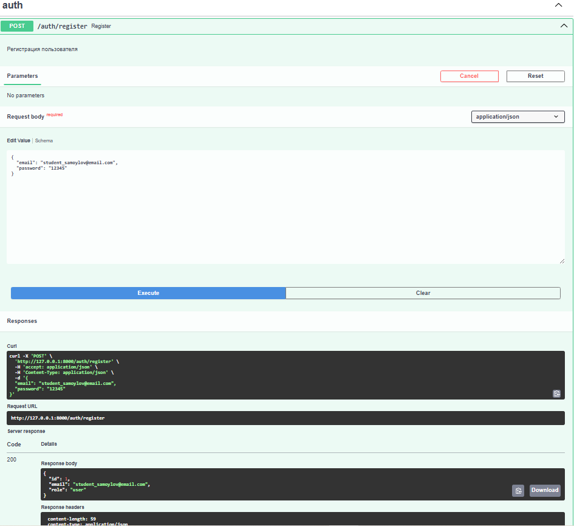
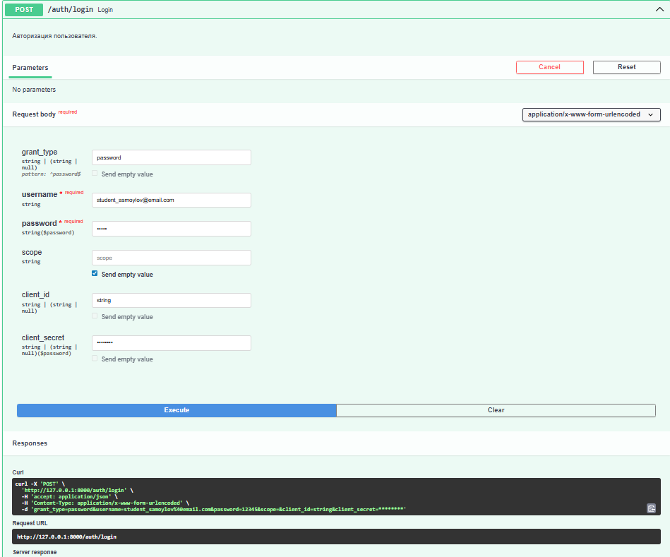
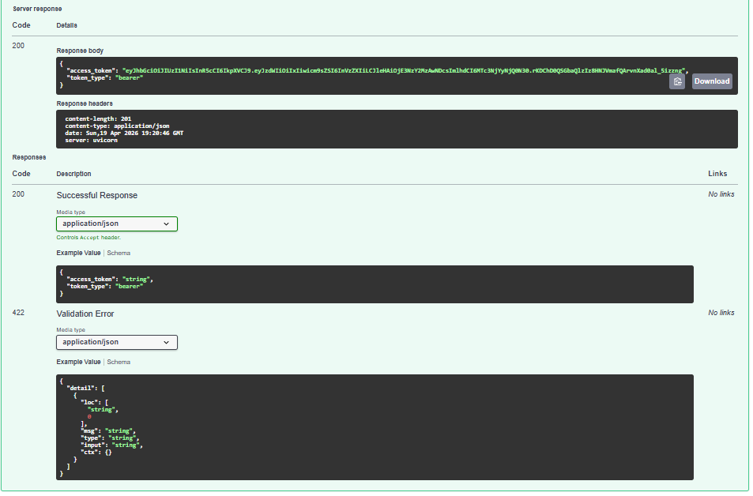
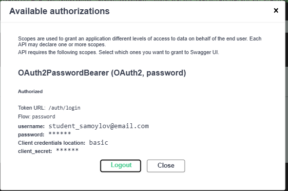
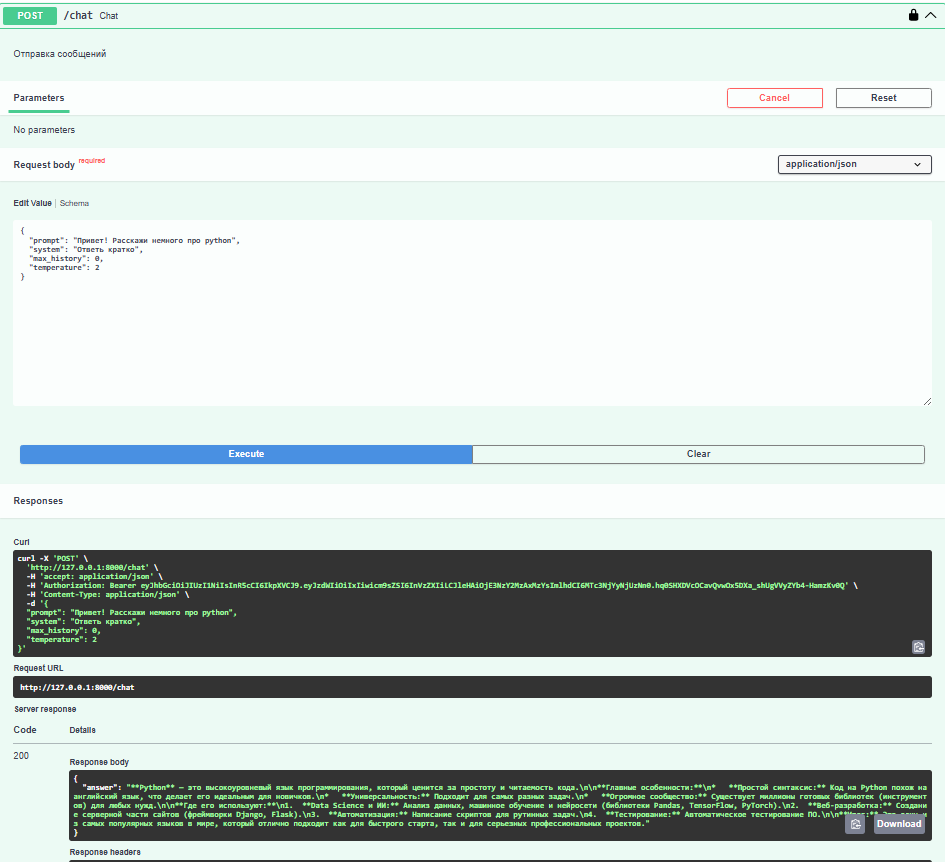
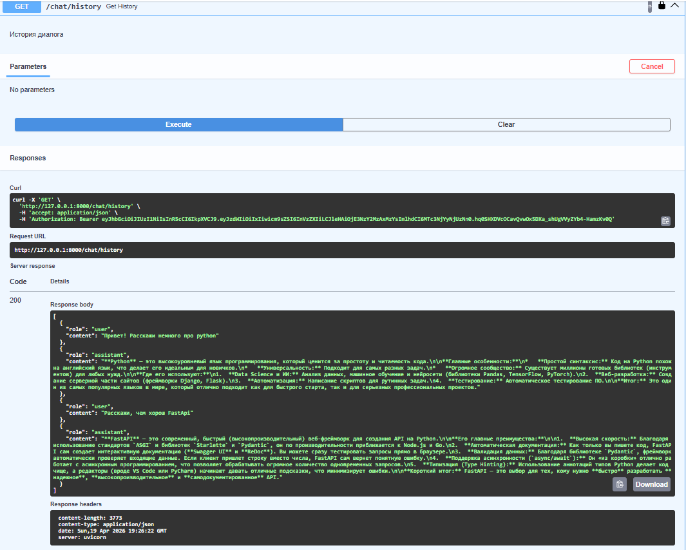
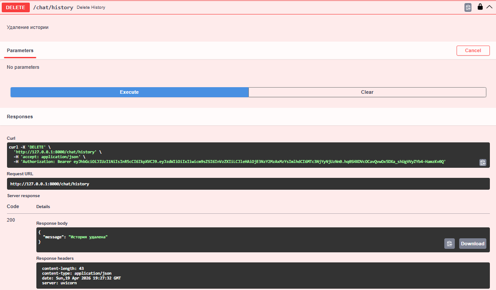
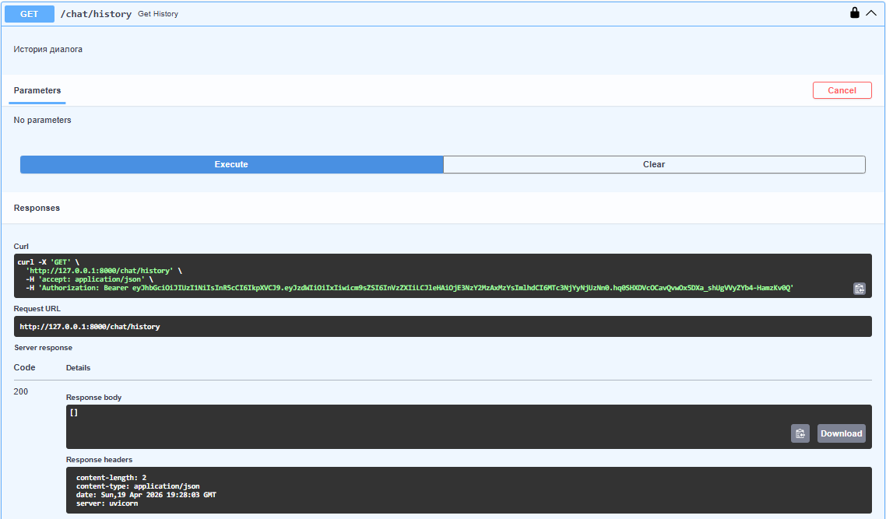

# llm-p
Серверное приложение на FastAPI, предоставляющее защищённый API для взаимодействия с LLM через OpenRouter. Реализованы регистрация и 
аутентификация пользователей с JWT, хранение пользователей и истории диалогов в SQLite, а также разграничение доступа по пользователям.
___
## Установка и запуск

### 1. Установка uv
```bash
pip install uv
```
### 2. Клонирование проекта
```bash
git clone https://github.com/IlyaSamoylov/llm-p
cd llm-p
```

### 3. Создание и активация виртуального окружения
```bash
uv venv
```
#### Linux:
```bash
source .venv/bin/activate
```

#### Windows:
```bash
.venv\Scripts\Activate.ps1
```

### 4. Установка зависимостей
```bash
uv sync
```

___
## Переменные среды
Скопируйте .env.example в .env в корне проекта

### Linux
```bash
cp .env.example .env
```

### Windows
```bash
Copy-Item .env.example .env
```
Заполните .env:
- Сгенерируйте свой API ключ на платформе [OpenRouter](https://openrouter.ai/) и установите в `OPENROUTER_API_KEY`:
- сгенерировать jwt секрет можно с помощью питон кода:
```python
import secrets, base64
print(base64.urlsafe_b64encode(secrets.token_bytes(32)).decode())
```
затем вставить в `JWT_SECRET`
- ссылку на бесплатную модель можно взять [здесь](https://openrouter.ai/models?fmt=cards&max_price=0&order=newest&output_modalities=text) 
и заполнить `OPENROUTER_MODEL`

```bash
APP_NAME=llm-p
ENV=local

SQLITE_PATH=./app.db
DATABASE_DRIVER=sqlite+aiosqlite

JWT_SECRET=change_me_super_secret
JWT_ALG=HS256
ACCESS_TOKEN_EXPIRE_MINUTES=60

OPENROUTER_API_KEY=your_openrouter_api_key
OPENROUTER_BASE_URL=https://openrouter.ai/api/v1
OPENROUTER_MODEL=meta-llama/llama-3.2-3b-instruct:free
OPENROUTER_SITE_URL=https://example.com
OPENROUTER_APP_NAME=llm-fastapi-openrouter
```
___
## Запуск
```bash
uv run uvicorn app.main:app --reload
```
после этого интерактивная документация будет доступна по ссылке:
http://127.0.0.1:8000/docs

___
## Структура проекта
```comandline
llm_p/
├── pyproject.toml                 # Зависимости проекта (uv)
├── README.md                      # Описание проекта и запуск
├── .env.example                   # Пример переменных окружения
│
├── app/
│   ├── __init__.py
│   ├── main.py                    # Точка входа FastAPI
│   │
│   ├── core/                      # Общие компоненты и инфраструктура
│   │   ├── __init__.py
│   │   ├── config.py              # Конфигурация приложения (env → Settings)
│   │   ├── security.py            # JWT, хеширование паролей
│   │   └── errors.py              # Доменные исключения
│   │
│   ├── db/                        # Слой работы с БД
│   │   ├── __init__.py
│   │   ├── base.py                # DeclarativeBase
│   │   ├── session.py             # Async engine и sessionmaker
│   │   └── models.py              # ORM-модели (User, ChatMessage)
│   │
│   ├── schemas/                   # Pydantic-схемы (вход/выход API)
│   │   ├── __init__.py
│   │   ├── auth.py                # Регистрация, логин, токены
│   │   ├── user.py                # Публичная модель пользователя
│   │   └── chat.py                # Запросы и ответы LLM
│   │
│   ├── repositories/              # Репозитории (ТОЛЬКО SQL/ORM)
│   │   ├── __init__.py
│   │   ├── users.py               # Доступ к таблице users
│   │   └── chat_messages.py       # Доступ к истории чатов
│   │
│   ├── services/                  # Внешние сервисы
│   │   ├── __init__.py
│   │   └── openrouter_client.py   # Клиент OpenRouter / LLM
│   │
│   ├── usecases/                  # Бизнес-логика приложения
│   │   ├── __init__.py
│   │   ├── auth.py                # Регистрация, логин, профиль
│   │   └── chat.py                # Логика общения с LLM
│   │
│   └── api/                       # HTTP-слой (тонкие эндпоинты)
│       ├── __init__.py
│       ├── deps.py                # Dependency Injection
│       ├── routes_auth.py         # /auth/*
│       └── routes_chat.py         # /chat/*
│
└── app.db                         # SQLite база (создаётся при запуске)
```
___
## Скриншоты
### Регистрация


### Логин и получение JWT



### Авторизация через Swagger


### Запрос к чату


### Получение истории


### Удаление истории


### История после удаления

